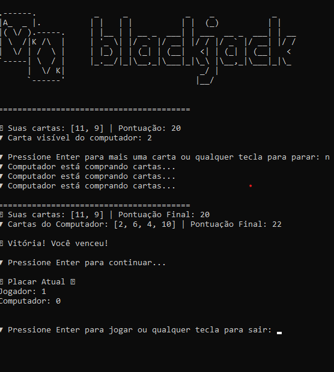

# 🃏 Blackjack no Console

[](https://www.python.org/downloads/)

Um jogo de Blackjack imersivo para terminal, desenvolvido em Python com animações ASCII e interatividade. Perfeito para quem quer praticar estratégias ou se divertir!

Divirta-se com o Blackjack!



## 📦 Estrutura do Projeto

```plaintext
blackjack-console/
└── src/
    ├── main.py          # Ponto de entrada do jogo
    └── art.py          # Arte ASCII e animações
```

## Como Usar

1. **Clone o repositório:**

   ```bash
   git clone https://github.com/maneuu/blackjack-console.git
   ```

2. **Navegue até a pasta do projeto:**

   ```bash
   cd blackjack-console/src
   ```

3. **Execute o jogo:**

   ```bash
   python main.py
   ```
